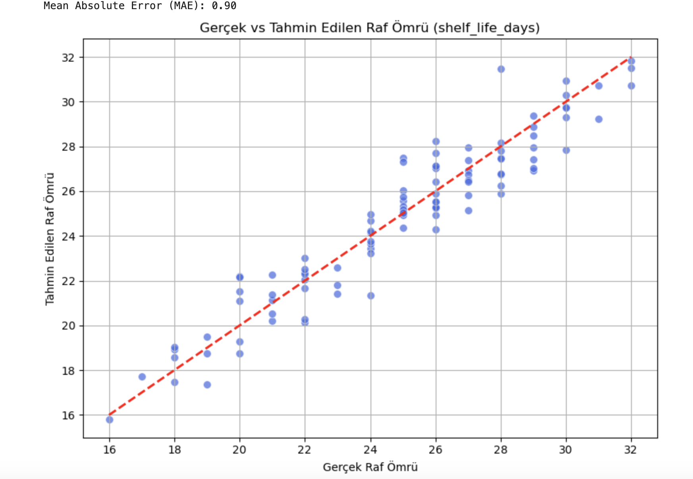

# Food Shelf Life Prediction

This project aims to predict the shelf life of food products based on features such as storage temperature, humidity, product type, packaging type, and preservatives. The goal is to build a predictive model that can estimate the number of days a product will stay fresh.

## 📌 Project Overview

The project uses a dataset with the following features:

- **storage_temperature**: The temperature at which the product is stored.
- **humidity**: The humidity level of the storage environment.
- **product_type**: The type of the food product.
- **package_type**: The packaging type used for the product.
- **preservatives**: Whether or not the product contains preservatives.
- **shelf_life_days**: The target variable representing the number of days the product remains fresh.

## 📁 Dataset
The dataset contains both numerical and categorical data used to train a machine learning model to predict the shelf life of food products. It is preprocessed using OneHotEncoding for categorical variables and scaling for numerical features.

## 📊 Data Generation
The dataset is automatically generated within the notebook. Random values are created for various features, and shelf life is computed based on a hidden formula. This data is saved as a CSV file programmatically—no need to upload or download one manually.

The dataset is saved as shelf_life_dataset.csv in the project directory. You can find and access this file directly in the repository. If you'd like to download the dataset manually.

## 🧰 Technologies Used

- **Python**: The primary programming language for this project.
- **Pandas**: For data manipulation and analysis.
- **Scikit-learn**: For implementing machine learning models and preprocessing.
- **Matplotlib / Seaborn**: For data visualization.
- **RandomForestRegressor**: A machine learning model used for regression tasks.

## ⚙️ Steps Involved

### 1. Data Preprocessing
- Categorical features are encoded using OneHotEncoding.
- Numerical features are used as-is.

### 2. Model Evaluation
Below is the scatter plot comparing the actual and predicted shelf life of food products. The   plot shows how well the model predicts the shelf life based on the features.

The Mean Absolute Error (MAE) of the model is approximately **0.90**, indicating the average prediction error for the shelf life in days.



### 3. How to Run the Code

#### ▶️ Open the Jupyter Notebook

Download and open the `Food-Shelf-Life-Prediction.ipynb` file in your Jupyter environment. Run each cell to generate the dataset, preprocess the data, and train the model.

#### 📦 Install the Required Dependencies

Before running the notebook, install the required packages by running:

```bash
pip install -r requirements.txt
``` 
## 📂 File Descriptions

- **Food-Shelf-Life-Prediction.ipynb**: The main Jupyter Notebook for data generation, preprocessing, model training, and evaluation.
- **requirements.txt**: Lists the required Python packages.
- **README.md**: This file.

## 📄 License

This project is licensed under the MIT License. See the [LICENSE](LICENSE) file for more details.
